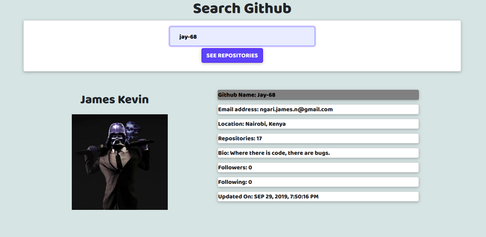

# Github Search


## Author

[James Ngari N](https://github.com/Jay-68)

## Description

This is an Angular CLI application that allows a user to enter a GitHub username into a form, submit it, and see names and descriptions of that person's public repositories. A person can also look for repositories based on github user name.

## Live preview screenshot



## Live Page Url
https://githubsearch-33e36.firebaseapp.com/github-search

Composed of two main components.
* `Search Users` -search for users on git-hub based on their usernames.
* `Search Repositories` -search for repositories on git-hub based on their author name.

## BDD ##
| Behavior                  | Input                     | Output                    |
| ------------------------- | ------------------------- | ------------------------- |
| Search for a github profile |Enter the username of the github User name | Displays the name, username, number of repositories,Joining date, followers, following and lists the repos  |

## Installation / Setup instruction
* Open Terminal {Ctrl+Alt+T}

* git clone ```https://github.com/Jay-68/githubSearch```

* `cd githubSearch`

* run `code .` in the terminal to open in visual studio code

* Run `ng serve` for a dev server. 

* Navigate to http://localhost:4200/

* `npm install && ng serve`

## Technologies Used ##

* Angular CLI
* HTML 
* CSS
* Bootstrap 
* Typescript
* Generated with [Angular CLI](https://github.com/angular/angular-cli) version 8.2.1.

## Known Bugs
* No known bugs. Report known bugs to <ngari.james.n@gmail.com>

## Contact Information 

If you have any question or contributions, please email me at <ngari.james.n@gmail.com>

## License
* *MIT License:*
* Copyright (c) 2019 **James Ngari N**